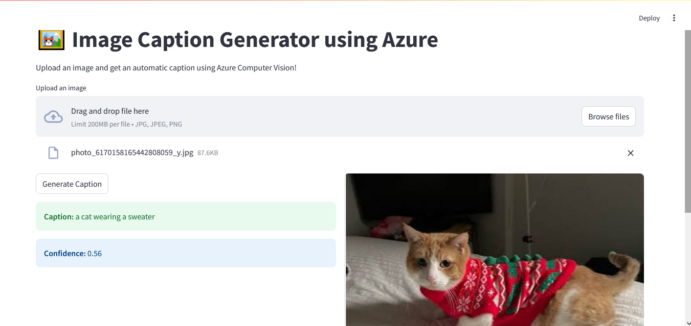

# 🖼️ Image Caption Generator using AI and Azure Computer Vision

This project uses **AI and Azure Computer Vision API** to generate automatic captions for uploaded images. Built with **Streamlit**, it offers a clean web UI to interact with the AI service and get captions along with confidence scores.

## 🔧 Features

- Upload any image (JPG/PNG)
- Get a description (caption) of what’s in the image
- Uses Microsoft Azure’s Computer Vision API
- Built with Python and Streamlit

## 📷 Sample Output



## 🚀 Getting Started

### 1. Clone the Repository

```bash
git clone https://github.com/your-username/image-caption-generator.git
cd image-caption-generator
```

### 2. Install Dependencies

```bash
pip install -r requirements.txt
```

### 3. Add Azure Keys

Open `app.py` and update these lines with your actual Azure credentials:

```python
AZURE_ENDPOINT = "https://<your-endpoint>.cognitiveservices.azure.com/"
AZURE_KEY = "<your-subscription-key>"
```

### 4. Run the App

```bash
streamlit run app.py
```

## 📁 Project Structure

```
image-caption-generator/
│
├── app.py                  # Streamlit app
├── requirements.txt        # Required Python packages
├── README.md               # Project details
└── assets/
    └── output-screenshot.png  # Sample output image
```

## ✅ Example

A cat wearing a sweater ➡️ Caption generated using Azure's API.
Upload an image, and the app will return a caption such as:
"a cat wearing a sweater"
with confidence score like 0.56


